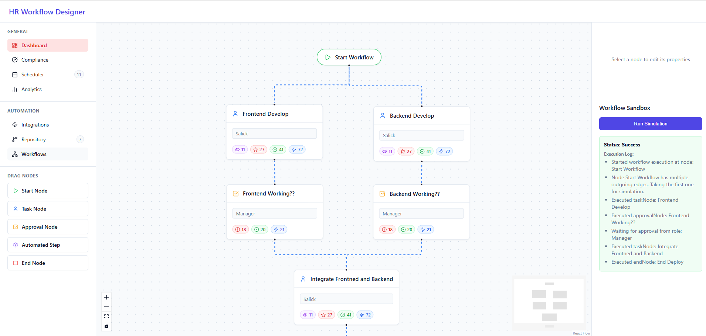
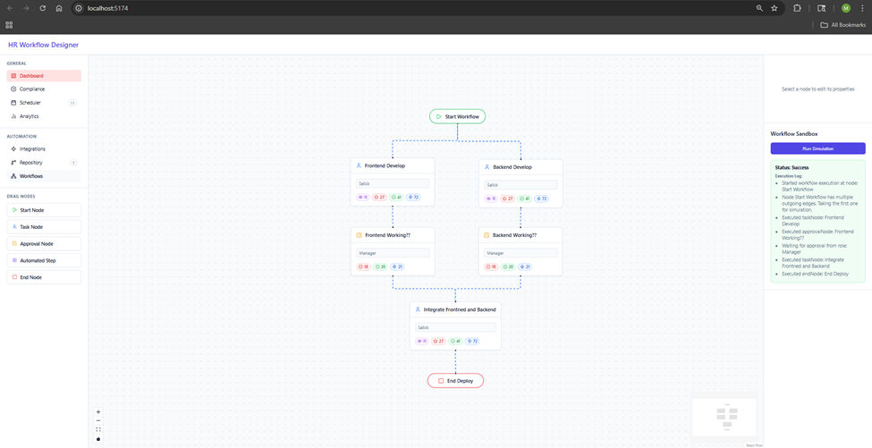
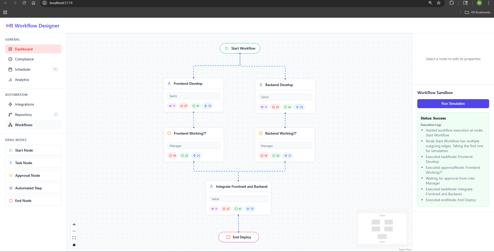
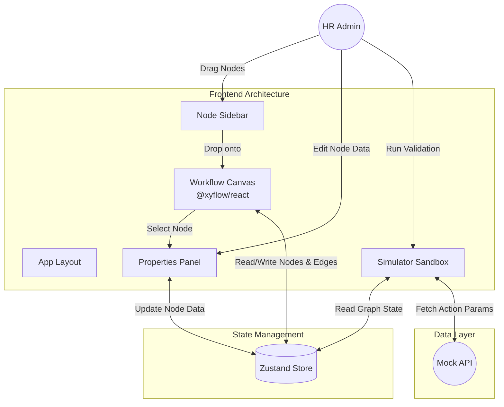

# 🚀 Canva Tredence HR Workflow Designer


A powerful, interactive prototype of an HR Workflow Designer Module. Built with modern web technologies, it empowers HR administrators to visually create, configure, and simulate internal workflows such as employee onboarding, leave approvals, and more.

---

## ✨ Key Features

- **Interactive Workflow Canvas**: A smooth drag-and-drop canvas powered by React Flow.
- **Versatile Node Types**: Supports 5 distinct nodes out of the box:
  - 🎬 **Start Node**: Initializes the workflow.
  - 📋 **Task Node**: Assigns manual tasks to personnel.
  - ✅ **Approval Node**: Manages role-based approvals and thresholds.
  - ⚙️ **Automated Step Node**: Executes automated actions (e.g., sending emails).
  - 🏁 **End Node**: Concludes the workflow with summary options.
- **Dynamic Properties Panel**: Context-aware forms that adapt to the selected node type, enabling real-time metadata updates.
- **Sandbox Simulator**: A built-in validation tool to check graph integrity, detect circular dependencies, and simulate step-by-step executions.
- **Mock API Integration**: Simulates asynchronous data fetching for automated actions and workflow executions.

---

## 📸 Screenshots

<p align="center">
  
  <br />
  
  <br />
  
</p>

---

## 🏗 Architecture & Workflow

The application follows a clean, modular architecture, leveraging global state management to synchronize the canvas, property panels, and simulator.

### Architecture Diagram



---

## 🛠 Technology Stack

This project is built using a modern, scalable tech stack to ensure performance, type-safety, and an excellent developer experience.

| Technology | Purpose |
| :--- | :--- |
| **[React 19](https://react.dev/)** | Core UI library for building modular components. |
| **[Vite](https://vitejs.dev/)** | Extremely fast build tool and development server. |
| **[TypeScript](https://www.typescriptlang.org/)** | Static typing to ensure robust node and edge data structures. |
| **[React Flow (@xyflow/react)](https://reactflow.dev/)** | Engine driving the interactive node-based graph editor. |
| **[Zustand](https://zustand-demo.pmnd.rs/)** | Lightweight, fast global state management (replaces complex context/prop drilling). |
| **[Lucide React](https://lucide.dev/)** | Clean, modern SVG icons for UI aesthetics. |

---

## 📂 Project Structure

```text
canva-tredance/
├── public/                 # Static public assets
├── src/
│   ├── api/                # Mock API logic (network & simulation separation)
│   ├── assets/             # Application images and global assets
│   ├── components/         # React components grouped by feature
│   │   ├── Canvas/         # React Flow canvas implementation
│   │   ├── nodes/          # Custom visual node components
│   │   ├── PropertiesPanel/# Dynamic configuration forms
│   │   ├── Sandbox/        # Validation and simulation logic
│   │   └── Sidebar/        # Drag-and-drop source panel
│   ├── store/              # Zustand global state (workflowStore.ts)
│   ├── types/              # Centralized TypeScript interfaces (workflow.ts)
│   ├── App.tsx             # Root application layout
│   ├── index.css           # Global vanilla CSS (custom properties, responsive layout)
│   └── main.tsx            # Application entry point
├── package.json            # Project metadata and dependencies
└── vite.config.ts          # Vite bundler configuration
```

---

## 🚀 Getting Started

Follow these instructions to set up the project locally on your machine.

### Prerequisites
- [Node.js](https://nodejs.org/) (v18 or higher recommended)
- `npm` (Node Package Manager)

### 1. Fork and Clone the Repository
To contribute or modify the project, it's recommended to fork it first.
1. Click the **Fork** button at the top right of this repository.
2. Clone your forked repository:
   ```bash
   git clone https://github.com/mohammedsalick/canva-tredence.git
   cd canva-tredence
   ```

### 2. Install Dependencies
```bash
npm install
```

### 3. Run the Development Server
```bash
npm run dev
```
Once the server starts, open your browser and navigate to `http://localhost:5173/`.

### 4. Build for Production (Optional)
To generate a production-ready bundle:
```bash
npm run build
```

---

## 💡 Usage Guide

1. **Add Nodes**: Drag nodes from the left **Sidebar** and drop them onto the central **Canvas**.
2. **Connect Nodes**: Click and drag from the output handle (bottom) of one node to the input handle (top) of another to create an edge.
3. **Configure Nodes**: Click on any node on the canvas. The **Properties Panel** on the right will update to show forms specific to that node type. Update the fields as necessary.
4. **Simulate**: Open the **Sandbox** panel on the bottom right. Click "Validate & Run" to check your workflow for errors (like missing connections or cycles) and see a simulated step-by-step execution.

---

## 🔮 Future Improvements

While this is a robust prototype, several enhancements are planned for future iterations:
- **Export/Import Capabilities**: Allow users to serialize the Zustand state to JSON and download/upload workflows.
- **Advanced Real-time Validation**: Display visual indicators (e.g., red glowing borders) directly on the canvas when a node is missing required configuration.
- **Undo/Redo History**: Implement a time-travel feature in the Zustand store (potentially using `zundo`).
- **Auto-layout Support**: Integrate engines like `dagre` to automatically organize complex, messy graphs into clean hierarchies.
- **Backend Integration**: Replace the mock API with a real backend service for persistent storage and real workflow execution.

---

*Designed and Developed for Canva Tredence.*